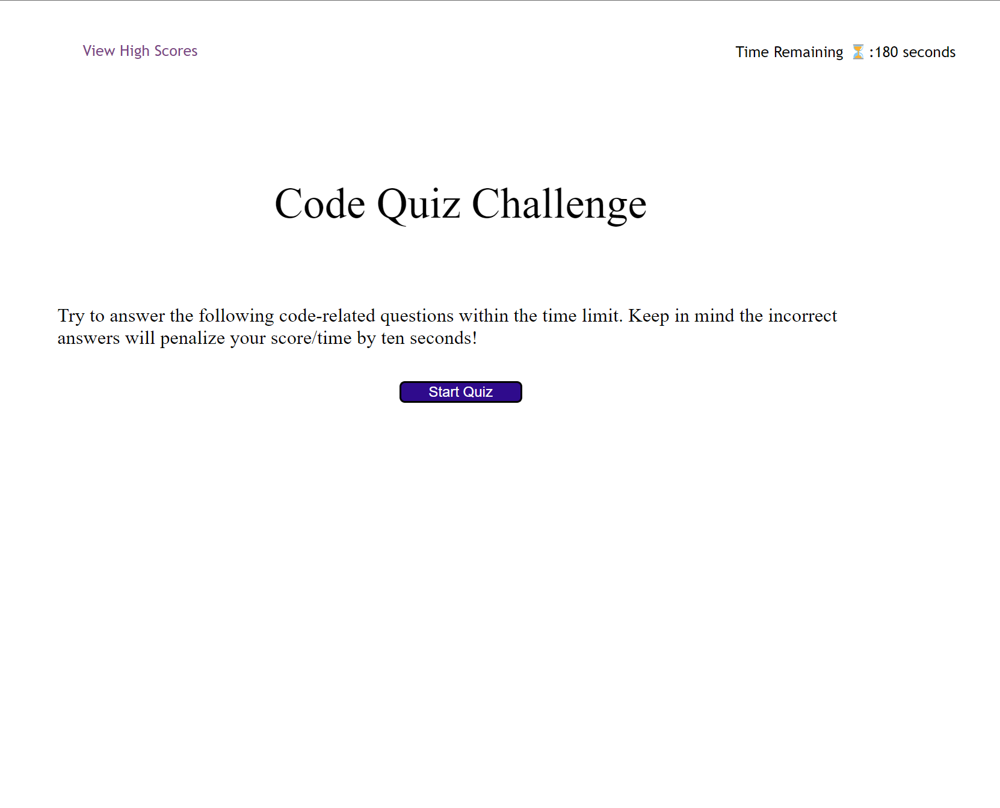
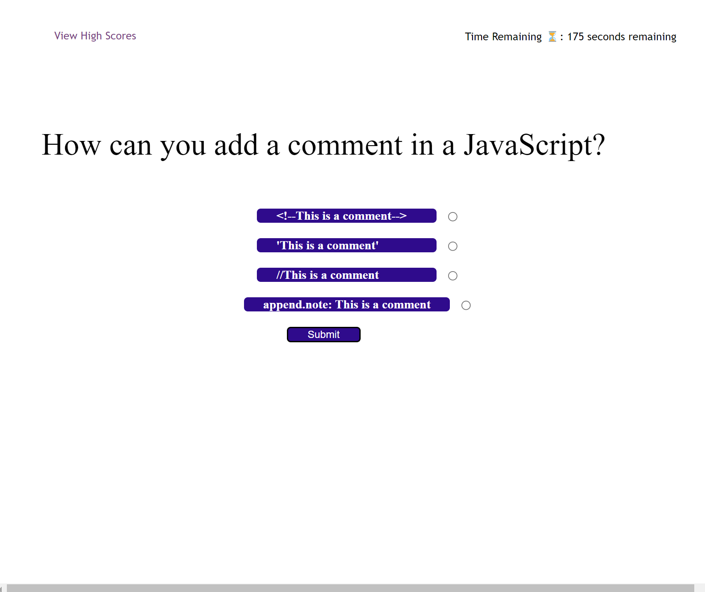
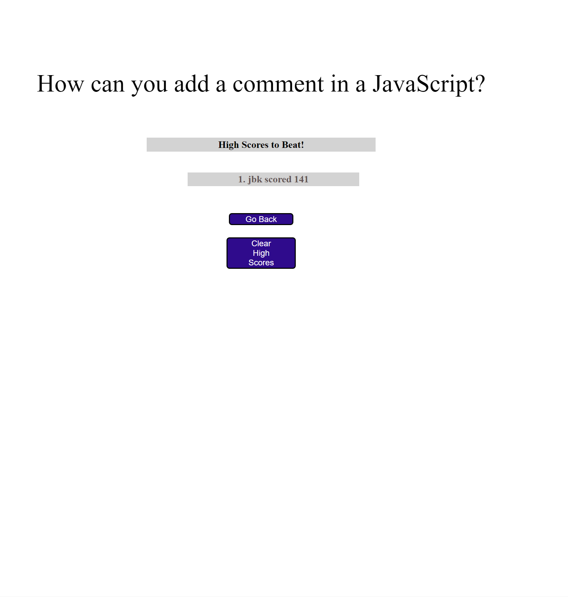

                                               # code-quiz-challenge

Code Quiz Website [https://quicksilver524.github.io/code-quiz-challenge/]

Github repo source [https://github.com/quicksilver524/code-quiz-challenge]

                                                    Description
    This is my code quiz. I wanted to make it functional to smaller screens and reflect any screen size without 
    offsetting data. Your score resembles the time left at the end of the quiz and you lose 10 seconds for each 
    wrong answer. The quiz will tell you it is a wrong choice helping you to pick a seperate answer. 

    The Code quiz is fully functional and will show multiple highscores as you repeatedly take the quiz. 
    No high scores are posted if no quizes have ever been performed.

Code Quiz Webpage:  
Code Quiz Webpage:  
Code Quiz Webpage:  
